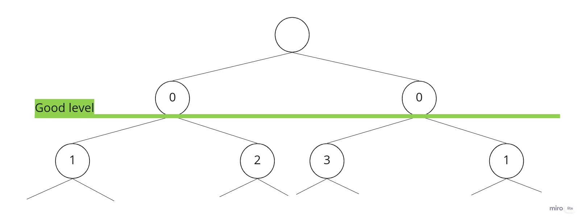

```{r setup, include=FALSE}
library(ggplot2)
```

# Introduction
In this report, there is written how a KD-Tree is implemanted and how it can be builded in serial or in a parallel way. 


In the serial part, the algorithm is costructed as a "normal" program, without keeping in consideration how the processor will works. In the parallel part, it will be consider how the processor can distribuite the amout of work among processes or threads. To implement this part, it was used two library for parallel programming, that are **OpenMP** and **Open MPI**. 

# Algorithm
A KD-Tree is a data structure presented originally by Friedman, Bentley and Finkel in 1977 to represent a set of k-dimensional data in order to make them efficiently searchable. A KD-Tree is a tree whose basic concept is to compare against 1 dimension at a time per level cycling
cleverly through the dimensions so that to keep the tree balanced. At each iteration $i$, it bisects the data along the chosen dimension $d$, creating a “left-” and “right-” sub-trees for which the 2 conditions $\forall x \in sub-tree, x_i < p_i$ and $\forall x \in sub-tree, x_i > p_i$ hold respectively, where $p \in D$ is a point in the data set and the sub-script $i$ indicates the component of the $i-th$ dimension.

To build the tree, two assumptions were made:

* The dataset, and hence the related KD-Tree, it's immutable;
* The data points are homogeneously distribuited in all the $k$ dimension, i.e. the data are taken pseudo-randomly from the function *rand()* of the *random* library of C++.

Since that can be assume that the data are homogeneously distributed in every dimension, it was decided to choose $p$ as the median element along each dimension. In this way, the binary three will be balanced.

These are the abstract steps to bulid the KD-Tree:

* First of all, along one dimension, the data points are partially sorted, in this way to find the median. 
* The pivot, that is the median, will be the root on the sub-three.
* All the elements that are in the left of the pivot will be the left child of the root and all the elements that are in the right of the pivot will be the right child of the root.
* The algorithm is applied recursively, with the left child points and the right child points that are the new data points of the first step.


# Implementation
The KD-Tree implementation was made with C++11 and is written to work with the number of k-dimension > 0 (*N_DIM > 0*). The implemented algorithm doesn't use a sorting algorithm, but it uses the function provided by the standard library "*std::nth_element()*". This function is a partial sorting algorithm that rearranges elements in *[first, last)* such that:

* The element pointed at by *nth* (the median) is changed to whatever element would occur in that position if *[first, last)* were sorted
* All of the elements before this new *nth* element (the median) are less than or equal to the elements after the new *nth* element.
With this function, it's possible to omit the implementation of a sorting algorithm because it has the best "worst expected running time", that is O(N).

For the testing and building phase, since the number are supposed to be described by an uniform distribution, it was decided to generate data randomly for all the axis. Each point has the random data and the number of dimensions of the data. Each node of the tree has the point that represent, the axis to which it's applied, the pointer to the left child and the pointer to the right child.

To implement the parallel part, it was decided to use two different methods. Unlike the OpenMP part, in which the code is pretty similar but with the addition of the *#pragma omp* parallel function that are called in the recursion phase, for the implementation of Open MPI the code (no the algorithm) changed a little bit. In fact, the strategy used to implement this part was to divide for each process, a sub-tree, that that will be merged in only one process. 

It's important to dived the work of the group (from the process 1 to the process N), that their primary function is to construct a sub-tree and send to the main process, and the work of the single process (the process 0), that his primary function is to merge all the sub-tree and to construct the final KD-Tree. These are the steps of the workers: 

* Until a good level of the final tree is reached, the group of processes builds the tree in a serial way. A good level is reached when the half of the number of process involved is equal to the power of 2 to level (so $np/2 == 2^{level}$).
* When you get to to this level, each process works alone creating in a serial way the sub-tree and send it to the master process, with the rank 0. There is a shared variable that assign the work of each process, that is it has to work in the right or in the left. If the number of process is smaller that the number of the sub-tree that has to built, this variable automatically assign which process has to work two times. 
Meanwhile, there is the process with rank 0, that does the first part like others processes and then waits to receive the messages with all of sub-trees. 



The main problem of this implemented code with Open MPI is that each sub-tree has to be serialized in a string before sending and deserialize the message received after. 

<!-- In this way, no process have to do two different times in a different node a sub-tree, expect for the process with rank 1. In fact, if the number of process is a power of 2 and since the process 0 doesn't build a sub-tree, this process is in charge to build, for the same level, the node that is further to the left (the first node) and the node that is further to the right (the last node). It was chosen this process because it's the first to finish and  -->

# Performance model and scaling

In this section it will presented the real performance of the function responsible for the construction of the tree in serial and in parallel. Theoretically specking, the performance of the parallel code must be better than the serial, because the work is spitted among the processes/thread.

```{r}
#preprocessing
proc <- data.frame(c(1,2,4,8,16,24))
colnames(proc) <- "Process"

serial <- read.table("../output/serial.out", header = FALSE, col.names = c("Serial"))
mp <- read.table("../output/mp.out", header = FALSE, col.names = c("mp"))

strong <- data.frame(proc, serial, mp)
```

```{r}
#Plot
# ggplot(data = strong)+
#     xlab("N of process") +
#     ylab("Time (s)") +
#     # scale_y_continuous(breaks = seq(0,9500,by=1000))+
#     # scale_y_continuous(trans="log2")+
#     geom_line(mapping = aes(Process, Serial, col = "Serial")) +
#     geom_point(mapping = aes(Process, Serial, col = "Serial")) +
#     geom_line(mapping = aes(Process, mp, col = "MP")) +
#     geom_point(mapping = aes(Process, mp, col = "MP")) 
#     # geom_smooth(mapping = aes(process, Serial))


```


```{r}
#Plot

mpi <- read.csv("../output/serialize.csv", header = F, col.names = c("ser_des", "mpi"))
mpi["no_ser_des"] <- mpi["mpi"] - mpi["ser_des"]
mpi["Process"] <- proc

plot1 <- merge(strong, mpi, by="Process")

ggplot(data = plot1)+
    xlab("N of process") +
    ylab("Time (s)") +
    theme_bw() + 
    scale_colour_brewer(type = "seq", palette = "Spectral") +
    scale_y_continuous(breaks = seq(0,650,by=100))+
    # scale_y_continuous(trans="log2")+
    geom_line(mapping = aes(Process, Serial, col = "Serial")) +
    geom_point(mapping = aes(Process, Serial, col = "Serial")) +
    geom_line(mapping = aes(Process, mpi, col = "Open MPI")) +
    geom_point(mapping = aes(Process, mpi, col = "Open MPI")) +
    geom_line(mapping = aes(Process, mp, col = "OpenMP")) +
    geom_point(mapping = aes(Process, mp, col = "OpenMP")) 
    # geom_line(mapping = aes(Process, no_ser_des, col = "Open MPI\nwithout deserializing")) +
    # geom_point(mapping = aes(Process, no_ser_des, col = "Open MPI\nwithout deserializing")) 
    


```

```{r}

ggplot(data = plot1)+
    xlab("N of process") +
    ylab("Time (s)") +
    theme_bw() + 
    scale_colour_brewer(type = "seq", palette = "Spectral") +
    scale_y_continuous(breaks = seq(0,650,by=100))+
    # scale_y_continuous(trans="log2")+
    geom_line(mapping = aes(Process, Serial, col = "Serial")) +
    geom_point(mapping = aes(Process, Serial, col = "Serial")) +
    geom_line(mapping = aes(Process, mpi, col = "Open MPI")) +
    geom_point(mapping = aes(Process, mpi, col = "Open MPI")) +
    geom_line(mapping = aes(Process, mp, col = "OpenMP")) +
    geom_point(mapping = aes(Process, mp, col = "OpenMP")) +
    geom_line(mapping = aes(Process, no_ser_des, col = "Open MPI\nwithout deserializing")) +
    geom_point(mapping = aes(Process, no_ser_des, col = "Open MPI\nwithout deserializing")) 

```


This is the time to serialize the full tree, and it can be aproximate as the sum of the time to serialize each sub-tree for every process.

# Discussion


CLOSE the swthreads are placed onto places as close as possible to each other (assigned to consecutive places in a round-robin way)
aaa


Basically, according to this law you will have approximately the same performance as for the lower count of threads. In a real life it will start to decrease at some point (where you have too many threads). You may observe that if you have thousands of threads

# Future implementation
Al posto di creare un vettore ogni volta, aggiungere come nel quick sort, un inizio e una fine

Migliorare la serializzazione e soprattutto la deserializzazione. Oppure mandare altro
